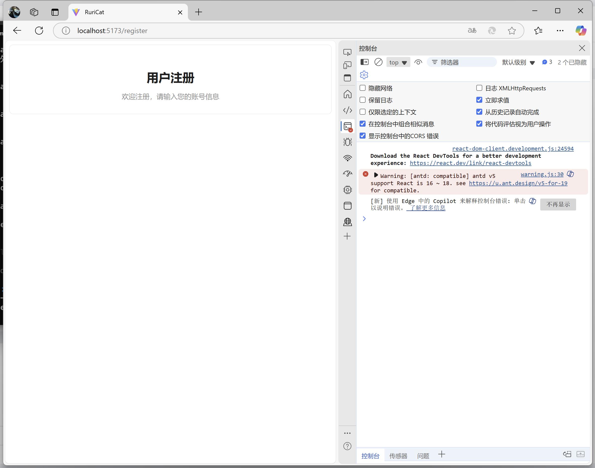
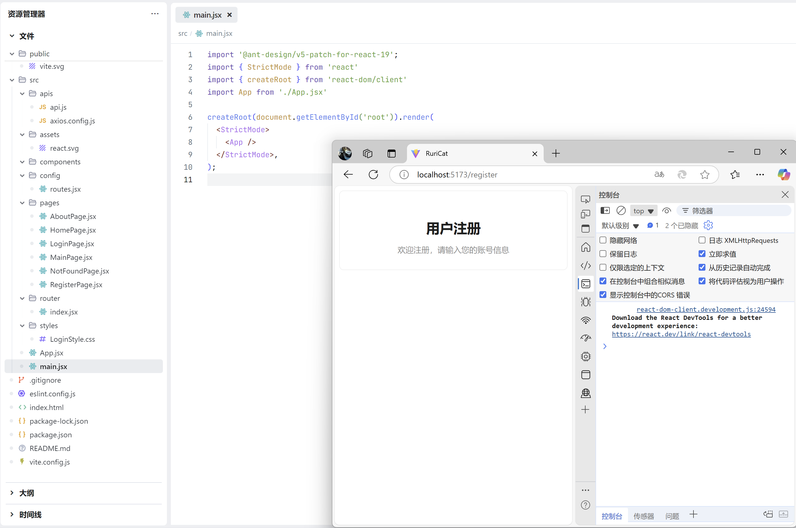

# RuriCat

当前版本：V1.0

## 项目结构

```
RuriCat-V1.0/
├── src/
│   ├── assets/            # 静态资源（图片、样式、图标）
│   ├── components/        # 可复用组件（如侧边栏myAside）
│   ├── data/             # 数据配置文件（如菜单数据MenuData）
│   ├── hocks/            # 自定义Hook
│   ├── mock/             # Mock数据模块
│   ├── router/           # 路由配置及模块化路由
│   ├── services/         # API服务层（请求封装、模块接口）
│   ├── stores/           # 状态管理
│   ├── utils/            # 工具函数
│   ├── views/            # 页面视图组件（首页/登录/注册/404等）
│   └── main.jsx          # 应用入口
├── public/               # 公共资源
└── vite.config.js        # Vite配置
```

## 模块关系

视图层(views) → 组件层(components) → 服务层(services)
↑                   ↓
路由层(router) ← 状态管理层(stores)
## 运行指南

```sh
# 安装依赖
npm install

# 开发模式
npm run dev

# 生产构建
npm run build
```

## 功能模块说明

### 核心模块

1. **路由模块**
    - 使用React Router v7实现动态路由加载
    - 支持路由守卫和权限控制
    - 模块化路由配置在router/modules目录

2. **服务层**
    - Axios封装位于services/request
    - API模块化管理在services/modules
    - 支持Mock数据拦截（开发环境）

3. **状态管理**
    - 使用React Context API
    - 用户认证状态全局管理
    - 侧边栏折叠状态维护

4. **UI组件库**
    - 基于Ant Design 5.x构建
    - 自定义主题配置在src/assets/css
    - 可复用组件库在components目录
## 开发问题汇总

### 样式隔离方案

采用CSS Module管理组件样式，通过xxx.module.css命名约定实现组件级样式隔离。

### 按需加载优化

通过Vite的dynamic import实现路由组件动态加载，有效减小首屏资源体积。

### 接口Mock方案

开发环境使用Mock.js拦截API请求，配置文件在mock/index.js中。

### Action One 初始化项目

```sh
# 创建项目
npm create vite@latest <项目名称>
# 进入项目目录并安装项目依赖
cd <项目名称> && npm install
# 测试项目是否正常启动
npm run dev
```

完成上述步骤后

清理项目初始样式文件

创建项目目录结构

配置路由文件

```sh
# 安装路由依赖
npm install react-router-dom
```

安装UI依赖

```sh
# 安装ant Design依赖
npm install antd --save
# 安装样式支持
npm install less --save
```

### Action Two 登录注册页面逻辑设计

- 登录界面设计
- 注册界面设计


## 开发问题汇总

### Antd在React 19 兼容

由于 React 19 调整了 `react-dom` 的导出方式，导致 antd 无法直接使用 `ReactDOM.render` 方法。因而使用 antd 会遇到以下问题：

- 波纹特效无法正常工作
- `Modal`、`Notification`、`Message` 等组件的静态方法无效

#### 问题复现



因而需要通过兼容配置，使 antd 在 React 19 中正常工作。

#### 兼容方式

以下方法任选其一，其中优先推荐使用兼容包。

##### 1.兼容包

安装兼容包

```sh
npm install @ant-design/v5-patch-for-react-19 --save
```

在应用入口处引入兼容包

```jsx
import '@ant-design/v5-patch-for-react-19';
```

##### 2.unstableSetRender

默认情况下，请优先使用兼容包。除非对于 umd、微应用等特殊场景，才使用 `unstableSetRender` 方法。`unstableSetRender` 为底层注册方法，允许开发者修改 ReactDOM 的渲染方法。在应用入口处写入：

```jsx
import { unstableSetRender } from 'antd';
import { createRoot } from 'react-dom/client';

unstableSetRender((node, container) => {
  container._reactRoot ||= createRoot(container);
  const root = container._reactRoot;
  root.render(node);
  return async () => {
    await new Promise((resolve) => setTimeout(resolve, 0));
    root.unmount();
  };
});
```

#### 解决效果



